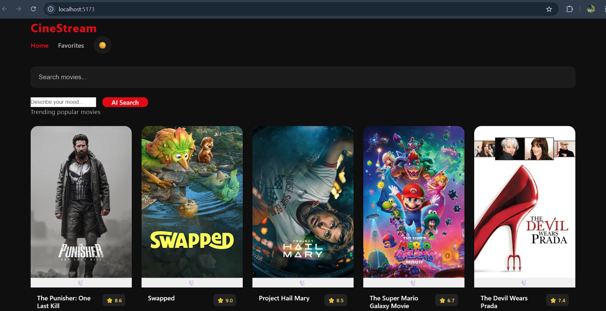
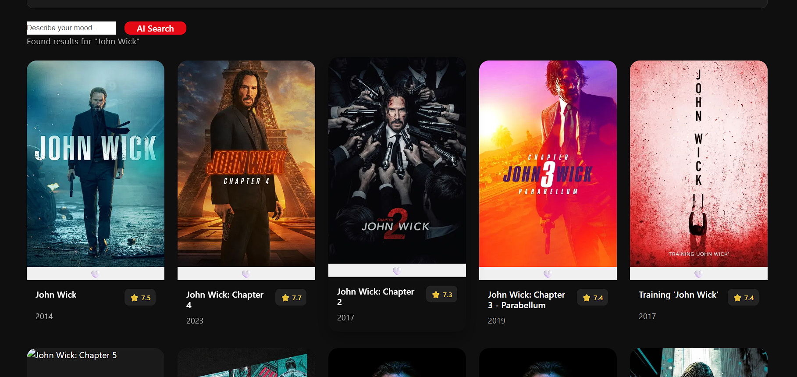

Project Live link: 
# 🎬 Cine-Stream

Cine-Stream is a Netflix-inspired Media Discovery Single Page Application (SPA) built using React and TMDB API.  
The application allows users to explore trending movies, search media content, save favorites, and even discover movies using AI-powered mood-based recommendations.

This project focuses heavily on scalable frontend architecture, API optimization, performance engineering, and modern React development practices.

---

# 🚀 Features

## ✅ Popular Movies Feed
- Fetches trending/popular movies from TMDB API
- Responsive Netflix-style movie grid
- Displays:
  - Movie Poster
  - Movie Title
  - Release Year
  - Ratings

---

## ✅ Smart Search System
- Search movies dynamically using TMDB Search API
- Debounced API requests (500ms delay)
- Prevents unnecessary API spam

---

## ✅ Infinite Scrolling
- Built using Intersection Observer API
- Automatically loads next movie pages while scrolling
- No manual pagination required

---

## ✅ AI Mood Matcher
Users can describe their mood naturally:

Example:
```txt
"I want a dark emotional thriller"
````

The AI:

1. Understands the mood prompt
2. Recommends a movie title
3. Automatically searches TMDB
4. Displays matching results

Powered using:

* Groq API
* LLaMA 3.1 model

---

## ✅ Favorites System

* Add/remove favorite movies
* Persistent storage using localStorage
* Dedicated Favorites page

---

## ✅ Theme Toggle

* Dark / Light mode support
* Theme preference persistence

---

## ✅ Performance Optimizations

* Lazy loading movie posters
* Infinite scrolling
* API request debouncing
* Duplicate movie prevention

---

# 🧠 Engineering Concepts Used

* React SPA Architecture
* Custom Hooks
* Context API
* Infinite Scroll Architecture
* Intersection Observer API
* Debounced Search
* LocalStorage Persistence
* API Chaining
* AI Integration
* Responsive UI Design
* Component-Based Architecture

---

# 🛠️ Tech Stack

| Category         | Technology       |
| ---------------- | ---------------- |
| Frontend         | React + Vite     |
| Routing          | React Router DOM |
| Styling          | CSS3             |
| HTTP Client      | Axios            |
| State Management | Context API      |
| AI API           | Groq API         |
| Movie Database   | TMDB API         |
| Persistence      | localStorage     |

---

# 📂 Project Structure

```txt
src/
│
├── app/
├── components/
├── context/
├── hooks/
├── pages/
├── services/
├── styles/
├── utils/
│
├── App.jsx
└── main.jsx
```

---

# ⚙️ Environment Variables

Create a `.env` file in the root directory:

```env
VITE_TMDB_API_KEY=your_tmdb_api_key

VITE_TMDB_BASE_URL=https://api.themoviedb.org/3

VITE_TMDB_IMAGE_BASE_URL=https://image.tmdb.org/t/p/w500

VITE_GROQ_API_KEY=your_groq_api_key
```

---

# ▶️ Installation & Setup

## 1️⃣ Clone Repository

```bash
git clone <repository_url>
```

---

## 2️⃣ Install Dependencies

```bash
npm install
```

---

## 3️⃣ Start Development Server

```bash
npm run dev
```

---

# 🌐 API References

## TMDB API

Used for:

* Popular movies
* Search functionality
* Movie metadata

Website:
[https://developer.themoviedb.org/](https://developer.themoviedb.org/)

---

## Groq API

Used for:

* AI Mood Matcher
* LLM-powered movie recommendation

Website:
[https://console.groq.com/](https://console.groq.com/)

---

# 📸 Core Functionalities

| Feature                  | Status |
| ------------------------ | ------ |
| Popular Movies           | ✅      |
| Search Movies            | ✅      |
| Infinite Scroll          | ✅      |
| Favorites                | ✅      |
| localStorage Persistence | ✅      |
| AI Mood Matcher          | ✅      |
| Theme Toggle             | ✅      |
| Lazy Loading             | ✅      |
| Responsive Design        | ✅      |

---

# 🎯 Project Objective

The main objective of this project is to simulate a scalable real-world media browsing platform while implementing production-level frontend engineering concepts such as:

* optimized rendering
* API throttling
* persistent state management
* AI integration
* modular architecture

---
# Application screenshots

 

# 📄 License

This project is for educational and learning purposes.
